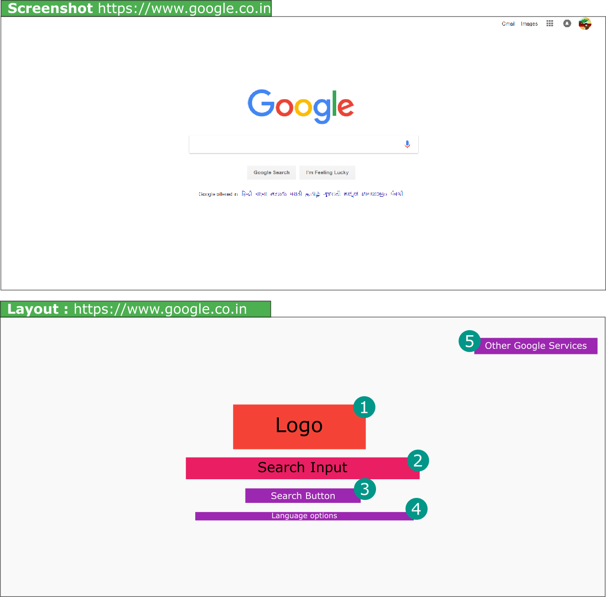

# Bootstrap Grid. 

Let me guess, you are a person who wants to arrange elements such as logo, headline, call to action button in a layout on your page. 
If that is true, you are in the right place. 

Let me explain you some basic terminologies before I move into explaining how you can use Bootstrap grid utilities to arrange things systemacially onto your page. 

## Layouts
The elements on the page can be arranged in many different layouts. But a good layout is the one which places things considering the convenience of the target user. To help you understand more about this. Check some layouts of top popular websites. 

1. https://www.google.com
Google.com tops wikipedia [top 10 websites in the world.](https://en.wikipedia.org/wiki/List_of_most_popular_websites) Lets checkout its layout. 

Inline-style: 


Isn't it a pretty simple layout with very little elements on the page. 


Every page has some sort of layout. 
Layout very simply means how we place the content on the website. 
For example 
Layout with 3 columns on a page. 
Layout with 1 column on the page. 

Bootstrap helps us to create these layouts. 

There are three main components of Bootstrap Grid. 
- Container
- Row
- columns. 

## Container. 
Container basically defines how much spacing we will have horizontally. 
Which in more simpler terms mean how much space we would have at the right and left of the content. 

How to create a container. 
```html
<div class="container">
<!-- Content inside container will come here -->
</div>
```

Container has two classes that we can use. 

1. **container** - Which adds responsive padding to the right and left of content. 
2. **container-fluid** - If the content iside needs to be displayed in full width. 


## Row. 
When ever we want columns we will first add a Row class. 
Row should come insde the containenr as shown below. 
```html
<div class="container">
  <div class="row">
  </div>
 </div>
<!-- Row -->
</div>
```

## Columns. 
Space is divided into 12 portions for columns and is applied using column classes. 

If we want 2 columns of equal sizes. The considering that the we have total 12 portions. It will be 
divided accordingly. So the first portion will be of 6 and second portion would be of 6. 

Example is as follows. 
```html
<div class="container">
  <div class="row">
    <div class="col-6">
    </div>
    <div class="col-6">
    </div>
  </div>
 </div>
<!-- Row -->
</div>
```

If we want a first column to be two portions and the thrird column to be of one portion. 
```html
<div class="container">
  <div class="row">
    <div class="col-8">
    </div>
    <div class="col-4">
    </div>
  </div>
 </div>
<!-- Row -->
</div>
```

## Resources. 

- Want to know tips and examples of good homepage layout. Checkout this article [https://www.websitebuilderexpert.com/awesome-home-page-design-layouts/](https://www.websitebuilderexpert.com/awesome-home-page-design-layouts/)
